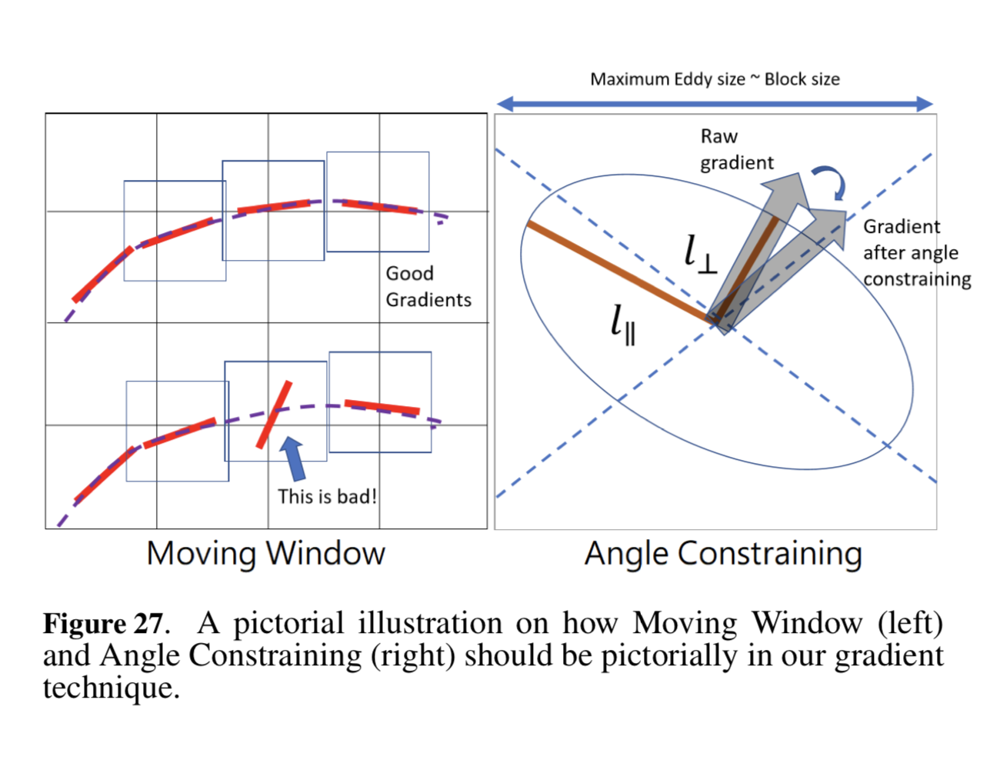

# Laztech Projects Introduction

## What is VGT / What is contained in VGT

VGT is a comprehensive name that contains a few lot of techniques. 

- **SPG**: Synchrontron Polarization Gradients
- **SIG**: Synchrontron Intensity Gradients 
- **IGs**: Intensity Gradients
- **VCGs**: Velocity Centroid Gradients
- **VChGs**: Velocity Channel Gradients

### *Relative Paper*

- **SPG**: Synchrontron Polarization Gradients
- **SIG**: Synchrontron Intensity Gradients 
- **IGs**: Intensity Gradients: [Tracing interstellar magnetic field using the velocity gradient technique in shock and self-gravitating media](https://arxiv.org/abs/1703.03026)
- **VCGs**: Velocity Centroid Gradients: [Velocity Gradients as a Tracer for Magnetic Fields](https://arxiv.org/abs/1608.06867)
- **VChGs**: Velocity Channel Gradients: [Tracing interstellar magnetic field using the velocity gradient technique in shock and self-gravitating media](https://arxiv.org/abs/1703.03026)

## Basic Method: Block Averaging, Moving Windows, Angle Constrain

### Block Averaging

Purpose: to let gradient follows a Gaussian Distribution in the block.

Without the concern of gravity and shock, the gradient should be *statistically* perpendicular to the magnetic field. So we lead to the question:

**What is (are) the smallest block size that make the blocks statistically follow Gaussian distribution?**

### Moving Windows

### Angle Constrain

### *Relative Paper*

Moving Window, Angle Constraining: [Tracing magnetic fields with spectroscopic channel maps](https://arxiv.org/abs/1703.03119)

[YL17a: ]

[Tracing interstellar magnetic field using the velocity gradient technique in shock and self-gravitating media](https://arxiv.org/abs/1703.03026)

## Synchrontron

[Synchrontron Radiation](https://en.wikipedia.org/wiki/Synchrotron_radiation) is a is the electromagnetic radiation emitted when charged particles are accelerated radially, i.e., when they are subject to an acceleration perpendicular to their velocity (**a** ⊥ **v**).

### *Relative Paper*

[Synchrotron intensity gradients as tracers of magnetic field](https://arxiv.org/abs/1701.07883): using synchrotron gradient to calculate 2d magnetic field

[Gradients of Synchrotron Polarization: Tracing 3D distribution of magnetic fields](https://arxiv.org/abs/1802.00028): 3d

## H1 (Neutral Hydrogen $^1H_2$)

### *Relative Paper*

[Tracing interstellar magnetic field using velocity gradient technique: Application to Atomic Hydrogen data](https://arxiv.org/abs/1802.00028): VGT to H1

[Mapping of the structure of the galactic magnetic field with velocity gradients: Test using star light polarization](https://arxiv.org/abs/1805.10329): 3D

## Radiative Transfer

### *Relative Paper*

[Velocity Gradients as a Tracer for Magnetic Fields](https://arxiv.org/abs/1608.06867)

[Tracing magnetic field morphology using the Velocity Gradient Technique in multiple self-gravitating molecular tracer maps](https://arxiv.org/abs/1809.09806)

# Chronological Reference 